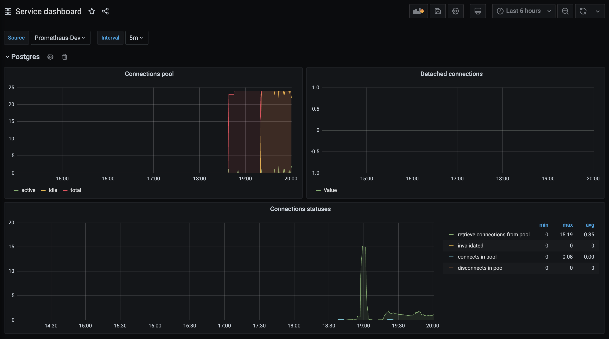

# SQLAlchemy-prometheus
Integration with prometheus metrics. Based on sqlalchemy-collectd.

# How to use it
Look at example directory.

# Grafana dashboard

<details><summary>Click to see source code</summary>

```json
{
  "annotations": {
    "list": [
      {
        "builtIn": 1,
        "datasource": "-- Grafana --",
        "enable": true,
        "hide": true,
        "iconColor": "rgba(0, 211, 255, 1)",
        "name": "Annotations & Alerts",
        "type": "dashboard"
      }
    ]
  },
  "editable": true,
  "gnetId": null,
  "graphTooltip": 0,
  "id": 54,
  "iteration": 1624553959096,
  "links": [],
  "panels": [
    {
      "datasource": null,
      "gridPos": {
        "h": 1,
        "w": 24,
        "x": 0,
        "y": 0
      },
      "id": 2,
      "title": "Postgres",
      "type": "row"
    },
    {
      "aliasColors": {},
      "bars": false,
      "dashLength": 10,
      "dashes": false,
      "datasource": "$source",
      "fieldConfig": {
        "defaults": {
          "custom": {}
        },
        "overrides": []
      },
      "fill": 1,
      "fillGradient": 0,
      "gridPos": {
        "h": 8,
        "w": 12,
        "x": 0,
        "y": 1
      },
      "hiddenSeries": false,
      "id": 4,
      "legend": {
        "avg": false,
        "current": false,
        "max": false,
        "min": false,
        "show": true,
        "total": false,
        "values": false
      },
      "lines": true,
      "linewidth": 1,
      "nullPointMode": "null as zero",
      "options": {
        "alertThreshold": true
      },
      "percentage": false,
      "pluginVersion": "7.2.2",
      "pointradius": 2,
      "points": false,
      "renderer": "flot",
      "seriesOverrides": [
        {
          "alias": "total",
          "color": "#F2495C"
        }
      ],
      "spaceLength": 10,
      "stack": false,
      "steppedLine": false,
      "targets": [
        {
          "expr": "sum(server_postgres_pool_active_connections)",
          "interval": "",
          "legendFormat": "active",
          "refId": "A"
        },
        {
          "expr": "sum(server_postgres_pool_idle_connections)",
          "interval": "",
          "legendFormat": "idle",
          "refId": "B"
        },
        {
          "expr": "sum(server_postgres_pool_total_connections)",
          "interval": "",
          "legendFormat": "total",
          "refId": "C"
        }
      ],
      "thresholds": [],
      "timeFrom": null,
      "timeRegions": [],
      "timeShift": null,
      "title": "Connections pool",
      "tooltip": {
        "shared": true,
        "sort": 0,
        "value_type": "individual"
      },
      "type": "graph",
      "xaxis": {
        "buckets": null,
        "mode": "time",
        "name": null,
        "show": true,
        "values": []
      },
      "yaxes": [
        {
          "format": "short",
          "label": null,
          "logBase": 1,
          "max": null,
          "min": null,
          "show": true
        },
        {
          "format": "short",
          "label": null,
          "logBase": 1,
          "max": null,
          "min": null,
          "show": true
        }
      ],
      "yaxis": {
        "align": false,
        "alignLevel": null
      }
    },
    {
      "aliasColors": {},
      "bars": false,
      "dashLength": 10,
      "dashes": false,
      "datasource": "$source",
      "fieldConfig": {
        "defaults": {
          "custom": {}
        },
        "overrides": []
      },
      "fill": 1,
      "fillGradient": 0,
      "gridPos": {
        "h": 8,
        "w": 12,
        "x": 12,
        "y": 1
      },
      "hiddenSeries": false,
      "id": 6,
      "legend": {
        "avg": false,
        "current": false,
        "max": false,
        "min": false,
        "show": true,
        "total": false,
        "values": false
      },
      "lines": true,
      "linewidth": 1,
      "nullPointMode": "null as zero",
      "options": {
        "alertThreshold": true
      },
      "percentage": false,
      "pluginVersion": "7.2.2",
      "pointradius": 2,
      "points": false,
      "renderer": "flot",
      "seriesOverrides": [],
      "spaceLength": 10,
      "stack": false,
      "steppedLine": false,
      "targets": [
        {
          "expr": "sum(server_postgres_detached_connections)",
          "interval": "",
          "legendFormat": "",
          "refId": "A"
        }
      ],
      "thresholds": [],
      "timeFrom": null,
      "timeRegions": [],
      "timeShift": null,
      "title": "Detached connections",
      "tooltip": {
        "shared": true,
        "sort": 0,
        "value_type": "individual"
      },
      "type": "graph",
      "xaxis": {
        "buckets": null,
        "mode": "time",
        "name": null,
        "show": true,
        "values": []
      },
      "yaxes": [
        {
          "format": "short",
          "label": null,
          "logBase": 1,
          "max": null,
          "min": null,
          "show": true
        },
        {
          "format": "short",
          "label": null,
          "logBase": 1,
          "max": null,
          "min": null,
          "show": true
        }
      ],
      "yaxis": {
        "align": false,
        "alignLevel": null
      }
    },
    {
      "aliasColors": {},
      "bars": false,
      "dashLength": 10,
      "dashes": false,
      "datasource": "$source",
      "fieldConfig": {
        "defaults": {
          "custom": {}
        },
        "overrides": []
      },
      "fill": 1,
      "fillGradient": 0,
      "gridPos": {
        "h": 8,
        "w": 24,
        "x": 0,
        "y": 9
      },
      "hiddenSeries": false,
      "id": 8,
      "legend": {
        "alignAsTable": true,
        "avg": true,
        "current": false,
        "max": true,
        "min": true,
        "rightSide": true,
        "show": true,
        "total": false,
        "values": true
      },
      "lines": true,
      "linewidth": 1,
      "nullPointMode": "null as zero",
      "options": {
        "alertThreshold": true
      },
      "percentage": false,
      "pluginVersion": "7.2.2",
      "pointradius": 2,
      "points": false,
      "renderer": "flot",
      "seriesOverrides": [],
      "spaceLength": 10,
      "stack": false,
      "steppedLine": false,
      "targets": [
        {
          "expr": "sum(rate(server_postgres_pool_checkout_count_total[$interval]))",
          "interval": "",
          "legendFormat": "retrieve connections from pool",
          "refId": "A"
        },
        {
          "expr": "sum(rate(server_postgres_pool_invalidated_count_total[$interval]))",
          "interval": "",
          "legendFormat": "invalidated",
          "refId": "B"
        },
        {
          "expr": "sum(rate(server_postgres_pool_connects_total[$interval]))",
          "interval": "",
          "legendFormat": "connects in pool",
          "refId": "C"
        },
        {
          "expr": "sum(rate(server_postgres_pool_disconnects_total[$interval]))",
          "interval": "",
          "legendFormat": "disconnects in pool",
          "refId": "D"
        }
      ],
      "thresholds": [],
      "timeFrom": null,
      "timeRegions": [],
      "timeShift": null,
      "title": "Connections statuses",
      "tooltip": {
        "shared": true,
        "sort": 0,
        "value_type": "individual"
      },
      "type": "graph",
      "xaxis": {
        "buckets": null,
        "mode": "time",
        "name": null,
        "show": true,
        "values": []
      },
      "yaxes": [
        {
          "format": "short",
          "label": null,
          "logBase": 1,
          "max": null,
          "min": null,
          "show": true
        },
        {
          "format": "short",
          "label": null,
          "logBase": 1,
          "max": null,
          "min": null,
          "show": true
        }
      ],
      "yaxis": {
        "align": false,
        "alignLevel": null
      }
    }
  ],
  "schemaVersion": 26,
  "style": "dark",
  "tags": [],
  "templating": {
    "list": [
      {
        "current": {
          "selected": true,
          "text": "Prometheus",
          "value": "Prometheus"
        },
        "hide": 0,
        "includeAll": false,
        "label": "Source",
        "multi": false,
        "name": "source",
        "options": [],
        "query": "prometheus",
        "queryValue": "",
        "refresh": 1,
        "regex": "",
        "skipUrlSync": false,
        "type": "datasource"
      },
      {
        "auto": false,
        "auto_count": 30,
        "auto_min": "10s",
        "current": {
          "selected": true,
          "text": "5m",
          "value": "5m"
        },
        "hide": 0,
        "label": "Interval",
        "name": "interval",
        "options": [
          {
            "selected": false,
            "text": "1m",
            "value": "1m"
          },
          {
            "selected": true,
            "text": "5m",
            "value": "5m"
          },
          {
            "selected": false,
            "text": "10m",
            "value": "10m"
          },
          {
            "selected": false,
            "text": "15m",
            "value": "15m"
          },
          {
            "selected": false,
            "text": "30m",
            "value": "30m"
          },
          {
            "selected": false,
            "text": "1h",
            "value": "1h"
          }
        ],
        "query": "1m,5m,10m,15m,30m,1h",
        "queryValue": "",
        "refresh": 2,
        "skipUrlSync": false,
        "type": "interval"
      }
    ]
  },
  "time": {
    "from": "now-6h",
    "to": "now"
  },
  "timepicker": {},
  "timezone": "",
  "title": "Service dashboard",
  "uid": "qn4bIiknz",
  "version": 3
}
```


</details>